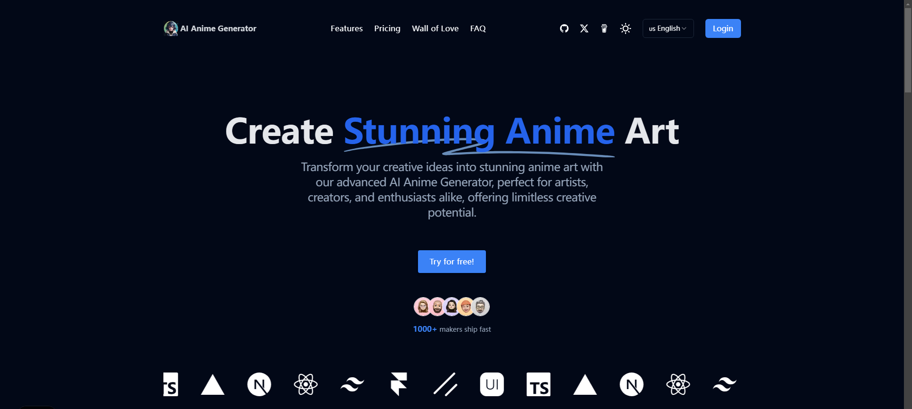

# AI Anime Generator 🚀

[](README-en.md)
[](README.md)

🎉 **Welcome to AI Anime Generator!**

**A powerful, out-of-the-box AI anime image generation website template—build your own AI creative platform with ease, no need to reinvent the wheel!**

AI Anime Generator is designed to help everyone quickly launch a modern, fully-featured AI anime generation website.  
Whether you're a developer, entrepreneur, or AI enthusiast, you can enjoy high-quality anime image generation and one-stop platform building here.

- **🚀 Lightning Fast Launch**: Build a modern, fully-featured AI anime generation website in minutes
- **🎨 High-Quality Images**: Integrated with Replicate API to generate stunning anime-style images
- **🛠️ Full-Stack Integration**: Built with Next.js, TailwindCSS, Clerk, Stripe, and Vercel—development, authentication, payment, and deployment all in one
- **💡 Highly Customizable**: Freely adjust UI, branding, and prompts to fit your creative needs
- **🌏 Production-Ready**: Built-in user authentication, payment, analytics, and one-click deployment for direct commercial use

> Turn your AI anime ideas into online products—fast!

**Demo**: [www.aianimegenerators.com](https://www.aianimegenerators.com/)

[](https://www.aianimegenerators.com/)

## Tech Stack

AI Anime Generator is built with the following technologies:

- Next.js – Frontend/Backend framework
- TailwindCSS – Styling
- Clerk – Authentication and user management
- Stripe – Payment processing
- Replicate API – AI image generation
- Google Analytics – Data analysis
- Vercel - Hosting service

## Local Development

After cloning the repository, you need to copy the `.env.example` file to create a `.env` file and fill in the necessary fields (especially the AI image generation API key).

Then, run the application in the command line, it will be available at `http://localhost:3000`.

```bash
npm run dev
```

## Build Your Project

Edit these files:
- `.env` or `.env.local`
- `config/site.ts`, fill in your website information
- `public` directory, change logo files
- `public/robots.txt`
- `app/sitemap.ts`

## One-Click Deployment

Deploy with Vercel or Zeabur:

[](https://vercel.com/new/clone?repository-url=https://github.com/yourusername/ai-anime-generator&project-name=ai-anime-generator&repository-name=ai-anime-generator&demo-title=AIAnimeGenerator&demo-description=AI%20Anime%20Image%20Generator&demo-url=https://www.aianimegenerators.com&demo-image=https://www.aianimegenerators.com/og.png)

## About Me

**AI Independent Developer**

[Github](https://github.com/Caron77)  
[Twitter/X](https://twitter.com/Caron7_7)  

If this project helps you, please star the repository and consider sponsoring me, thank you.

<a href="https://www.buymeacoffee.com/yourusername" target="_blank"></a>

<a href="https://afdian.net/a/yourafdianusername" target="_blank"></a>

 