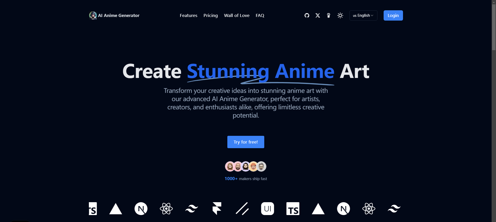

🌍 *[English](README.md) ∙ [简体中文](README-zh.md)*


# [AI Anime Generator](https://www.aianimegenerators.com/)

这是一个可以帮助你快速搭建 AI 网站的模板，支持多种 AI 功能集成。

演示地址：https://www.aianimegenerators.com/

[](www.aianimegenerators..com/)

## 技术栈 

AI Anime Generator 基于以下技术构建：

- Next.js – 前端/后端框架
- TailwindCSS – 样式设计
- Clerk – 用户认证与管理
- Stripe – 支付处理
- Replicate API – AI 图像生成
- Google Analytics – 数据分析
- Vercel - 托管服务


## 本地运行

克隆仓库后，您需要复制 `.env.example` 文件创建 `.env` 文件并填写必要的字段（特别是 AI 图像生成 API 密钥）。

然后，在命令行中运行应用程序，它将在 `http://localhost:3000` 可用。

```bash
npm run dev
```

## 构建您的项目

编辑这些文件：
- `.env` 或 `.env.local`
- `config/site.ts`，填写您的网站信息
- `public` 目录，更改 logo 文件
- `public/robots.txt`
- `app/sitemap.ts`

## 一键部署

使用 Vercel 部署示例：

[](https://vercel.com/new/clone?repository-url=https://github.com/Caron77/ai-anime-generator&project-name=&repository-name=ai-anime-generator&demo-title=AIAnimeGenerator&demo-description=AI%20动漫图像生成器&demo-url=您的演示链接&demo-image=您的OG图片链接)


## 关于我

**AI独立开发者**

[Github](https://github.com/Caron77)  
[Twitter/X](https://twitter.com/Caron7_7)  
[即刻](https://okjk.co/E9hAvS) 
[微信公众号](AI大模型应用实战)  

如果这个项目对您有帮助，请给仓库点个星并考虑赞助我，谢谢。

<a href="buymeacoffee.com/caron77" target="_blank"></a>

